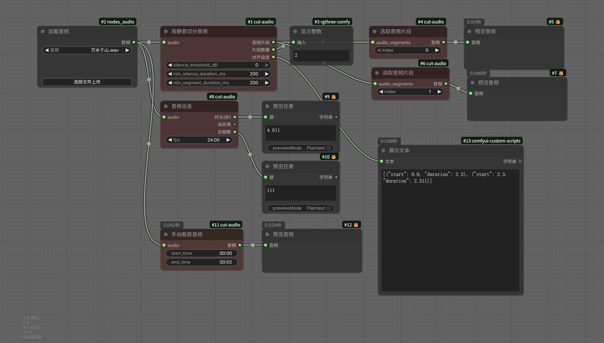

# ComfyUI-cut-audio

ComfyUI 自定义节点扩展，提供音频裁切与信息获取功能。

## 功能

该扩展包含 **4 个节点**，覆盖音频处理的核心场景：

| 节点 | 显示名称 | 功能描述 |
|------|----------|----------|
| `AudioInfo` | 音频信息 | 获取音频的时长、采样率及对应视频帧数 |
| `AudioSplitBySilence` | 按静音切分音频 | 自动检测静音区间，将音频切分为多个片段 |
| `AudioManualCut` | 手动裁剪音频 | 通过指定起止时间（`mm:ss` 格式）裁剪音频 |
| `AudioSelectSegment` | 选取音频片段 | 从批量音频片段中按索引提取单个片段 |

所有节点位于节点菜单的 `audio/cut-audio` 分类下。



## 安装

### 方式一：通过 ComfyUI Manager（推荐）

在 ComfyUI Manager 中搜索 `ComfyUI-cut-audio` 并安装。

### 方式二：手动安装

```bash
cd ComfyUI/custom_nodes
git clone https://github.com/mailzwj/ComfyUI-cut-audio.git
```

安装依赖：

```bash
pip install torch
```

> **注意：** 此扩展依赖 `comfy_api`，ComfyUI 通常已内置该模块。

## 节点详解

### AudioInfo — 音频信息

获取输入音频的基本信息。

**输入：**

| 参数 | 类型 | 默认值 | 说明 |
|------|------|--------|------|
| `audio` | AUDIO | — | 输入音频 |
| `fps` | FLOAT | 24.0 | 视频帧率，用于计算总帧数 |

**输出：**

| 输出 | 类型 | 说明 |
|------|------|------|
| 时长(秒) | FLOAT | 音频总时长 |
| 采样率 | INT | 音频采样率（Hz） |
| 总帧数 | INT | 对应指定帧率的总帧数 |

---

### AudioSplitBySilence — 按静音切分音频

根据静音间隔自动检测并切分音频。使用能量阈值与滑动窗口算法进行静音检测。

**输入：**

| 参数 | 类型 | 默认值 | 说明 |
|------|------|--------|------|
| `audio` | AUDIO | — | 输入音频 |
| `silence_threshold_dB` | FLOAT | -40.0 | 静音阈值（dB），低于此值视为静音 |
| `min_silence_duration_ms` | INT | 300 | 触发切分的最短静音时长（毫秒） |
| `min_segment_duration_ms` | INT | 200 | 短于此时长的片段将被丢弃 |

**输出：**

| 输出 | 类型 | 说明 |
|------|------|------|
| 音频片段 | AUDIO | 批量音频片段（Padded） |
| 片段数量 | INT | 切分出的片段总数 |
| 对齐信息 | STRING | JSON 格式，包含每个片段的起始时间和时长 |

---

### AudioManualCut — 手动裁剪音频

通过指定精确的起止时间裁剪音频片段。

**输入：**

| 参数 | 类型 | 默认值 | 说明 |
|------|------|--------|------|
| `audio` | AUDIO | — | 输入音频 |
| `start_time` | STRING | `"00:00"` | 开始时间，格式 `mm:ss` |
| `end_time` | STRING | `"00:05"` | 结束时间，格式 `mm:ss` |

**输出：**

| 输出 | 类型 | 说明 |
|------|------|------|
| 音频 | AUDIO | 裁剪后的音频片段 |

---

### AudioSelectSegment — 选取音频片段

从 `AudioSplitBySilence` 产生的批量片段中，按索引选取单个片段。

**输入：**

| 参数 | 类型 | 默认值 | 说明 |
|------|------|--------|------|
| `audio_segments` | AUDIO | — | 批量音频片段（来自 AudioSplitBySilence） |
| `index` | INT | 0 | 要提取的片段索引（从 0 开始） |

**输出：**

| 输出 | 类型 | 说明 |
|------|------|------|
| 音频 | AUDIO | 选中的单个音频片段 |

## 典型工作流

```
[加载音频] → [AudioInfo] → 获取音频信息
     │
     ▼
[AudioSplitBySilence] → 自动按静音切分
     │
     ▼
[AudioSelectSegment] → 选取特定片段
     │
     ▼
[后续处理 / 视频合成]
```

## 兼容性

- 基于 `comfy_api` 框架开发，兼容 ComfyUI 最新版本
- 使用 PyTorch 进行音频张量处理
- 支持 Python 3.10+

## 许可

[Apache License 2.0](LICENSE)
